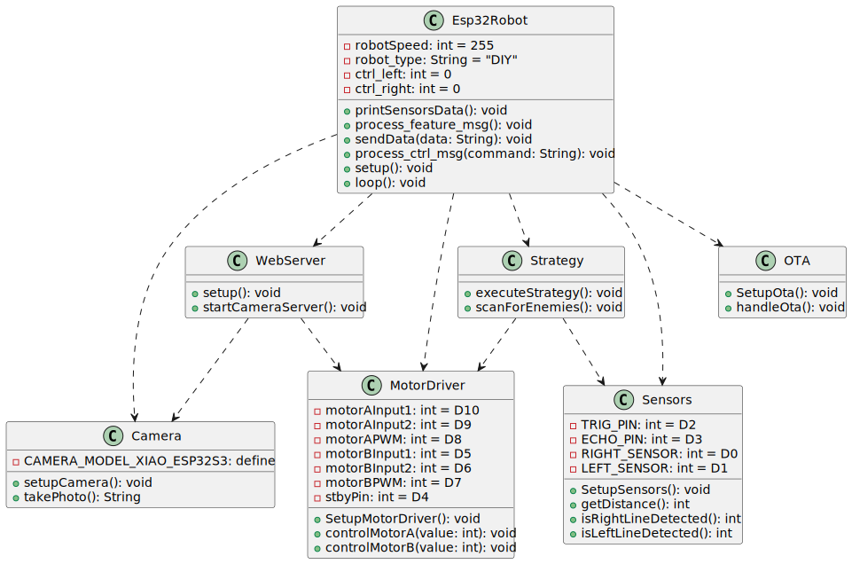

# ESP32Robot
The goal of this project is to create code for the ESP32 S3 to control motors, gather readings from sensors and the camera, and expose all this functionality through a serial interface.

## Configuration Steps
To prepare your ESP32 in the Arduino IDE, follow these configuration steps:

<table>
<tr>
    <th>Step</th>
    <th>Description</th>
    <th>Image</th>
</tr>
<tr>
    <td>1</td>
    <td>Configure the Arduino board manager to manage the ESP32.</td>
    <td></td>
</tr>
<tr>
    <td>2</td>
    <td>Set the OPIPSRAM option (to use the camera on Xiao ESP32-S3 Sense).</td>
    <td></td>
</tr>
</table>

## Code Design

The following UML diagram illustrates the architecture of the software system.

- ### Core Classes: 
    `Esp32Robot:` Main controller of the robotic system. It directly manages core functions by interacting with the  `Camera`, `MotorDriver`, and   `Sensors` modules. It exposes functionalities of these modules through a serial interface, allowing for command processing, data sending, and the execution of a main loop for robot operations.
 

- ### Other Classes and Their Specific Tasks:
    `WebServer:` A class responsible for setting up the camera server. This enables remote streaming and control over the robot's movements and camera through a web interface.

    `Strategy:` Contains logic that decides the robot's movement or actions based on sensor data and internal algorithms.

    `OTA (Over-The-Air) Update:` Allow the robot's software to be updated remotely without physical access to the device.

 

