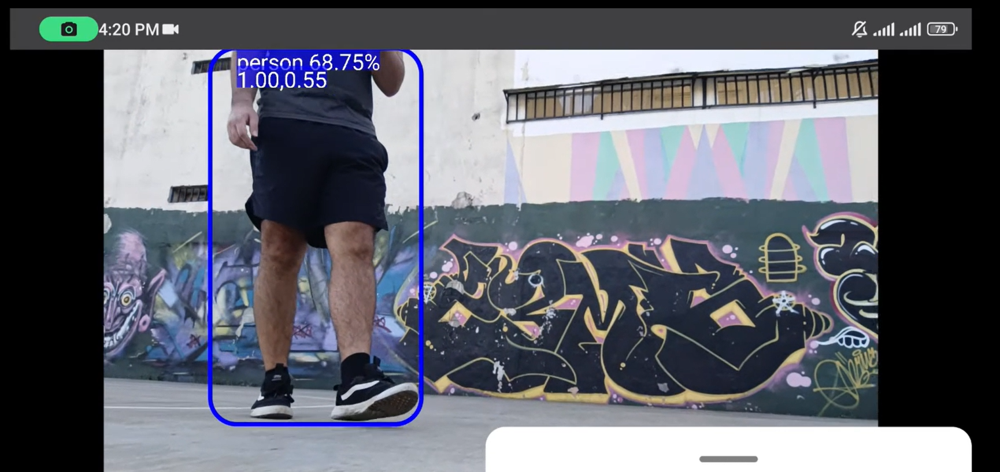

# MobileRobot Hardware

## Overview
The purpose of this section is to provide a detailed description of the design and construction process of the robot used in this project.

### Hardware Files
- `LaserCase`: Contains the `.stl` and `.svg` files for laser-cutting the components of the robot's case.
- `PCB`: Includes the EasyEDA JSON files `1-Schematic_SumoBot.json` and `2-PCB_PCB_SumoBot.json` for the schematic and PCB layout.

## Licenses
The schematics and PCB design were created by me, and the design files are made available under the MIT License. See the [LICENSE.md](LICENSE.md) file for the full license text.

## Materials
To build the MobileRobot, you'll need the following hardware components. Visual references for each part are provided below.

<table>
<tr>
    <td>
         
        <strong>Breadboard</strong>
    </td>
    <td>
         
        <strong>Distance Sensor</strong>
    </td>
</tr>
<tr>
    <td>
         
        <strong>Microcontroller (Xiao esp32 S3 Sense)</strong>
    </td>
    <td>
         
        <strong>Motor Driver</strong>
    </td>
</tr>
<tr>
    <td>
         
        <strong>Power Source</strong>
    </td>
    <td>
         
        <strong>Tank Chassis</strong>
    </td>
</tr>
<tr>
    <td>
         
        <strong>Track Sensor</strong>
    </td>
    <td>
         
        <strong>Jumper Wires</strong>
    </td>
</tr>
</table>

## Circuit Design
This schematic describes all the needed connections between modules in order to get the robot working.

## Building Steps
To start creating the circuit, follow these steps in sequence:

<table>
<tr>
    <th>Step</th>
    <th>Description</th>
    <th>Image</th>
</tr>
<tr>
    <td>1</td>
    <td>Connection of the motor module, microcontroller, and battery.</td>
    <td></td>
</tr>
<tr>
    <td>2</td>
    <td>Adding sensors and camera to the circuit.</td>
    <td></td>
</tr>
<tr>
    <td>3</td>
    <td>Assembly of the tank chassis and motors.</td>
    <td></td>
</tr>
<tr>
    <td>4</td>
    <td>Attaching the electronics to the chassis.</td>
    <td></td>
</tr>
</table>

## Circuit Testing
At this point, the robot's circuit can be completely tested with simple Arduino code for reading sensors and sending commands to the motors using the MCU's digital pins, performing tasks such as obstacle avoidance or line avoiding, as in this example.
- Once the robot pass all sensors, motor control, video streaming tests we can order the PCB in order to simplfy the circuit.
 

## PCB 
Using EasyEda auto-routing converting schematic to pcb is really fast.
<a href="PCB/README.txt">
    PCB Files Here
</a>

<table>
<tr>
    <th>Description</th>
    <th>Image</th>
</tr>
<tr>
    <td>PCB Front view.</td>
    <td>
    </td>
</tr>
<tr>
    <td>PCB Back view.</td>
    <td></td>
</tr>
<tr>
    <td>Updated robot.</td>
    <td></td>
</tr>
</table>

## Laser Bumper
Laser cut estructure would be useful in order to place track and ultrasonic sensors.

- First design made usign cardboard
<table>
<tr>
    <th>Description</th>
    <th>Image</th>
</tr>
<tr>
    <td>Bumper Front view.</td>
    <td>
    </td>
</tr>
<tr>
    <td>Bumper Back view.</td>
    <td></td>
</tr>
</table>

- Final laser cut piece
<table>
<tr>
    <th>Description</th>
    <th>Image</th>
</tr>
<tr>
     <td>Bumper Front view.</td>
    <td>
    </td>
</tr>
<tr>
    <td>Bumper Back view.</td>
    <td></td>
</tr>
</table>

## Open Bot interface
In order to make this robot compatible with open bot i made the following changes.
<table>
<tr>
    <th>Description</th>
    <th>Image</th>
</tr>
<tr>
     <td>Add magnetic phone holder.</td>
    <td>
    </td>
</tr>
<tr>
    <td>Replace 5V pin power input by USB C power supply taken directly from OTG Android device.</td>
    <td></td>
</tr>
</table>

## Robot capabilities summary:
- Sumobot behavior

 
- Local web-server operation over WIFI

 
- Offline Object Tracking (Open Bot)
