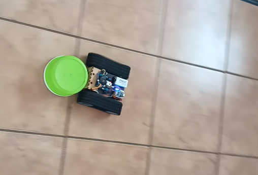
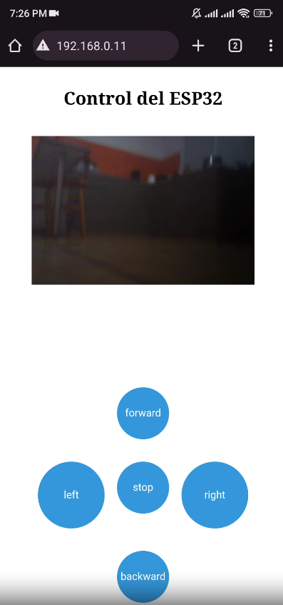
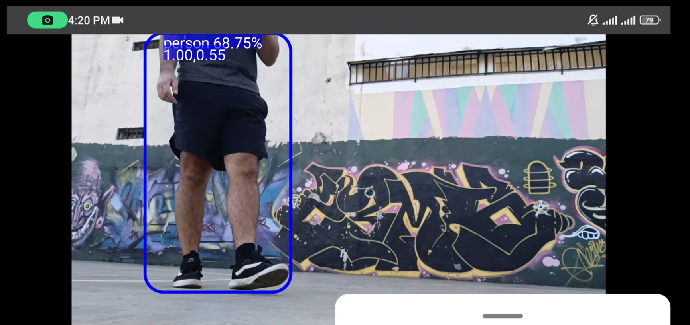

# SerialRobot
The SerialRobot project encapsulates the essence of DIY and the maker movement, emphasizing hands-on experience in both building and programming robots. It stands as a experience of the joy found in crafting something tangible and interactive that bridges the physical and digital realms.

This repository represents the adventure of constructing a personal robot, offering rich learning experiences through the integration of diverse software technologies and the exploration of hardware modifications. SerialRobot goes beyond a mere platform; it represents an ongoing experiment about the mechanics, electronics and software used in robot construction, fostering a deeper understanding of the elements that bring these machines to life.

## Features
- **SumoBot**: A competitive sumo wrestling mode that challenges other robots in power and strategy.

 

- **Remote Operation**: Control the robot from a distance, offering a wide range of applications from remote surveillance to telepresence.

 

- **OpenBot Interface**: Integrates with the OpenBot framework to leverage smartphones as an intelligent onboard control system.

 

## Getting Started
To begin using MobileRobot:
1. Clone the repository to download the source code.
2. Refer to the [Installation Guide](/Installation.md) for detailed setup instructions.
3. Consult the [Documentation](/Docs) for comprehensive examples and tutorials on how to utilize the various features.

Your contributions, feedback, and queries are welcome. Please check the [CONTRIBUTING.md](/CONTRIBUTING.md) for guidelines on participating in this project.

## Licenses
This project incorporates the OpenBot interface by Intel ISL, which is distributed under the MIT License. The terms of the OpenBot license are detailed in [OpenBot_LICENSE.md](OpenBot_LICENSE.md).

This project itself is also released under the MIT License - see the [LICENSE.md](LICENSE.md) for full license text.

## Acknowledgments
Special thanks to Intel ISL for developing OpenBot and making it available to the community under the MIT License.
