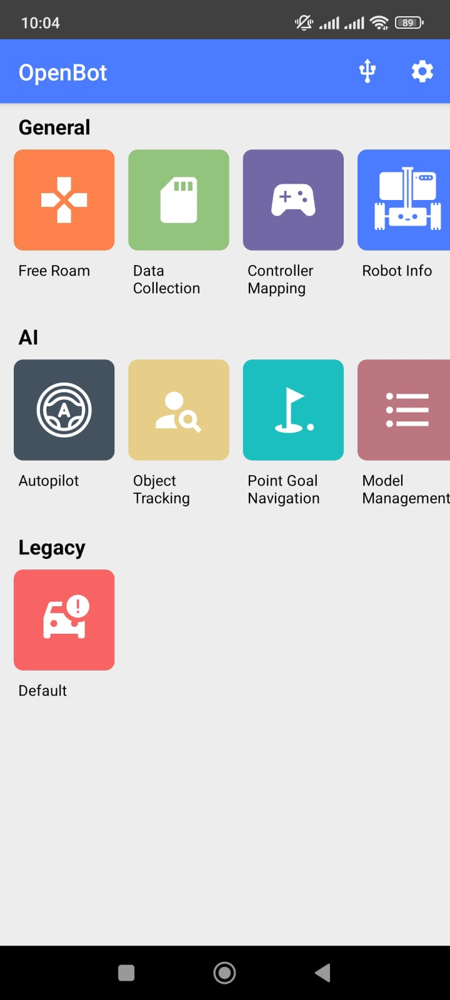

# SerialRobot

## Project Overview
This repository represents the adventure of constructing a personal robot, offering rich learning experiences through the integration of diverse software technologies and the exploration of hardware modifications.
<table>
  <tr>
    <td align="center">
    
    </td>
    <td align="center">
    
    </td>
  </tr>
</table>

## Key Features
- **SumoBot**: A competitive sumo wrestling mode that challenges other robots in power and strategy.
<table>
  <tr>
    <td align="center">
      
      
Click the image to watch the video

    </td>
  </tr>
</table>
  
- **Remote Operation**: Control the robot from a distance, offering a wide range of applications from remote surveillance to telepresence.
<table>
  <tr>
    <td align="center">
      
      
Click the image to watch the video

    </td>
  </tr>
</table>

- **OpenBot Interface**: Integrates with the OpenBot framework to leverage smartphones as an intelligent onboard control system.
<table>
  <tr>
    <td align="center">
      
      
Click the image to watch the video

    </td>
    <td align="center">
      
    </td>
  </tr>
</table>

## Documentation index

- **Documentation**
This section shows the step-by-step instructions and the progress made during each phase of the project.
[Hardware Components](./Hardware)
[Software Components](./Esp32Robot)
 

- **Execution instructions**
Follow this guide to run the application.
<a href="/SETUP.md">Setup Instructions</a>
 

## Licenses
This project incorporates the OpenBot interface by Intel ISL, which is distributed under the MIT License. The terms of the OpenBot license are detailed in [OpenBot_LICENSE](OpenBot/LICENSE.txt).

This project itself is also released under the MIT License - see the [LICENSE.md](LICENSE.md) for full license text.